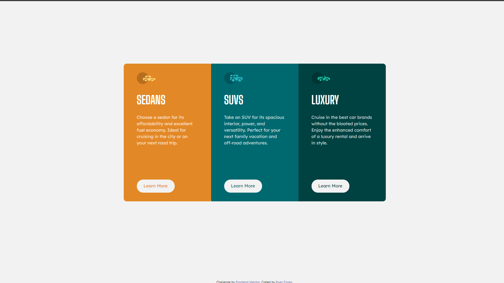

# Frontend Mentor - 3-column preview card component solution

This is a solution to the [3-column preview card component challenge on Frontend Mentor](https://www.frontendmentor.io/challenges/3column-preview-card-component-pH92eAR2-). Frontend Mentor challenges help you improve your coding skills by building realistic projects. 

## Table of contents

- [Overview](#overview)
  - [The challenge](#the-challenge)
  - [Screenshot](#screenshot)
  - [Links](#links)
  - [Built with](#built-with)
  - [What I learned](#what-i-learned)
  - [Continued development](#continued-development)
- [Author](#author)

## Overview

### The challenge

Users should be able to:

- View the optimal layout depending on their device's screen size
- See hover states for interactive elements

### Screenshot

Solution Screenshot (Desktop Version) - 

### Links

- Solution URL: [https://www.frontendmentor.io/solutions/3-column-preview-card-component-EhpR5ivca](https://www.frontendmentor.io/solutions/3-column-preview-card-component-EhpR5ivca)
- Live Site URL: [https://3-column-preview-card-1tqe6k9bh-ryanflorestt.vercel.app/](https://3-column-preview-card-1tqe6k9bh-ryanflorestt.vercel.app/)

## My process

### Built with

- Semantic HTML5 markup
- CSS custom properties

### What I learned

This challenge I am feeling a lot more comfortable writing CSS and HTML than the last. I know I still have a lot to learn and I know I can most definetly improve the functionality of the HTML by using bootstrap more effectively, which I will continue to learn and update this project at a later time. I wanted to get the Desktop Version looking good, the mobile verison looks okay, with the exception that each card has different values for the border radius.

### Continued development

To be updated.

### Useful resources

## Author

- Website - [Ryan Flores](https://ryanflorestt.github.io/cv/)
- Frontend Mentor - [@RyanFloresTT](https://www.frontendmentor.io/profile/RyanFloresTT)
- Twitter - [@_TrustyTea](https://www.twitter.com/_TrustyTea)

