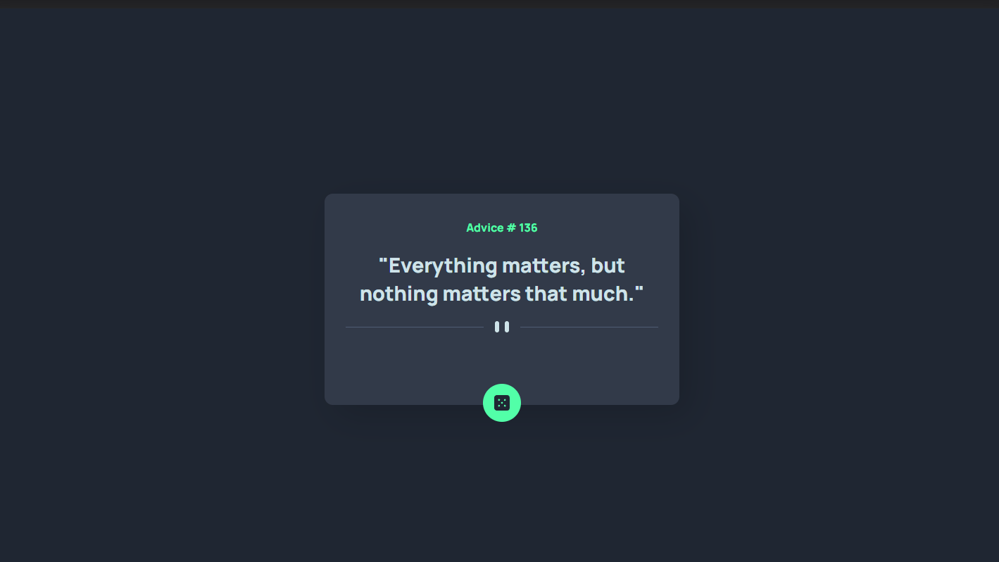

# Frontend Mentor - Advice generator app solution

This is a solution to the [Advice generator app challenge on Frontend Mentor](https://www.frontendmentor.io/challenges/advice-generator-app-QdUG-13db). Frontend Mentor challenges help you improve your coding skills by building realistic projects.

## Table of contents

- [Overview](#overview)
  - [The challenge](#the-challenge)
  - [Screenshot](#screenshot)
  - [Links](#links)
- [Author](#author)

## Overview

### The challenge

Users should be able to:

- Click on a button to call the API and generate a new piece of advice to display.

### Screenshot

### Links

- Solution URL: [https://www.frontendmentor.io/solutions/advice-generator-app-ryxKtl2Sg](https://www.frontendmentor.io/solutions/advice-generator-app-ryxKtl2Sg)
- Live Site URL: [https://advice-generator-rouge.vercel.app](https://advice-generator-rouge.vercel.app)

## Author

- Website - [GitHub](https://github.com/RyanFloresTT/)
- Frontend Mentor - [@RyanFloresTT](https://www.frontendmentor.io/profile/RyanFloresTT)
- Twitter - [@rryanflorres](https://www.twitter.com/rryanflorres)
