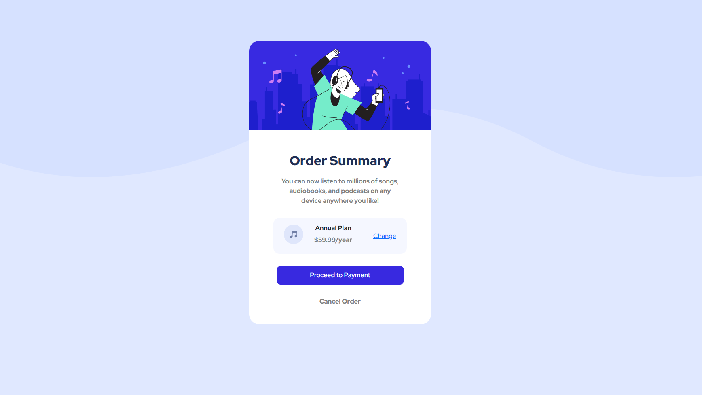

# Frontend Mentor - Order summary card solution

This is a solution to the [Order summary card challenge on Frontend Mentor](https://www.frontendmentor.io/challenges/order-summary-component-QlPmajDUj). Frontend Mentor challenges help you improve your coding skills by building realistic projects. 

## Table of contents

- [Overview](#overview)
  - [The challenge](#the-challenge)
  - [Screenshot](#screenshot)
  - [Links](#links)
  - [Built with](#built-with)
- [Author](#author)

## Overview

### The challenge

Users should be able to:

- See hover states for interactive elements

### Screenshot

- Desktop Version - 

### Links

- Live Site URL: [https://order-summary-component-ten-kappa.vercel.app/](https://order-summary-component-ten-kappa.vercel.app/)
- Soltuion URL : [https://www.frontendmentor.io/solutions/responsive-landing-page-38wdTXISv](https://www.frontendmentor.io/solutions/responsive-landing-page-38wdTXISv)

### Built with

- HTML5
- Bootstrap
- CSS 

## Author

- Website - [Ryan Flores](https://ryanflorestt.github.io/cv/)
- Frontend Mentor - [@RyanFloresTT](https://www.frontendmentor.io/profile/RyanFloresTT)
- Twitter - [@_TrustyTea](https://www.twitter.com/_TrustyTea)

