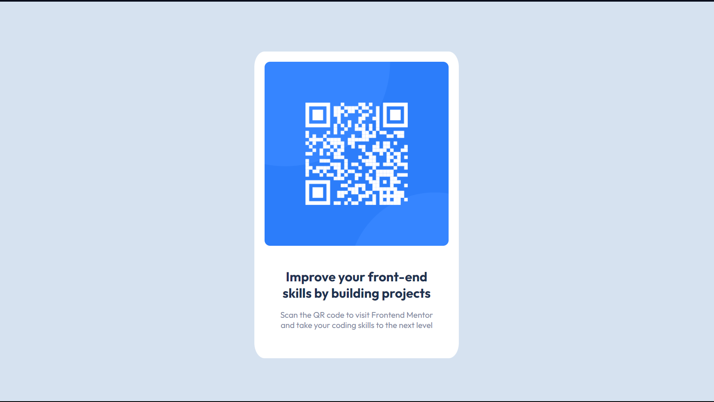

# Frontend Mentor - QR code component solution

This is a solution to the [QR code component challenge on Frontend Mentor](https://www.frontendmentor.io/challenges/qr-code-component-iux_sIO_H). Frontend Mentor challenges help you improve your coding skills by building realistic projects.

## Table of contents

- [Overview](#overview)
  - [Screenshot](#screenshot)
  - [Links](#links)
  - [Built with](#built-with)
  - [What I learned](#what-i-learned)
- [Author](#author)

## Overview

### Screenshot



### Links

- Solution URL: [https://www.frontendmentor.io/solutions/qr-code-component-solution-bdBqFbEYx](https://www.frontendmentor.io/solutions/qr-code-component-solution-bdBqFbEYx)
- Live Site URL: [https://qr-code-component-two-nu.vercel.app](https://qr-code-component-two-nu.vercel.app)

### Built with

- HTML5
- CSS

### What I learned

```css
/* CSS Combinators! */
.qr-text p {
  color: pink;
}
```

## Author

- Website - [Ryan Flores](https://ryanflorestt.github.io/cv/)
- Frontend Mentor - [@RyanFloresTT](https://www.frontendmentor.io/profile/RyanFloresTT)
- Twitter - [@\_TrustyTea](https://twitter.com/_TrustyTea)
