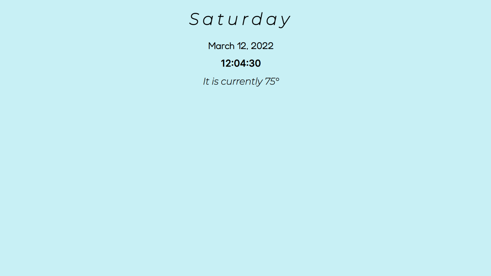

## Table of contents

- [Screenshot](#screenshot)
- [Links](#links)
- [Built with](#built-with)
- [What I learned](#what-i-learned)
- [Continued development](#continued-development)
- [Author](#author)

### Screenshot



### Links

- Live Site URL: [Add live site URL here](https://your-live-site-url.com)

### Built with

- HTML5
- CSS
- Flexbox
- [React](https://reactjs.org/) - JS library
- [Axios](https://axios-http.com) - Promise Based HTTP Client

### What I learned

```js
import { useEffect, useState } from "react";
const axios = require("axios");

export default function Weather() {
  const [temp, setTemp] = useState(0);

  async function getWeatherData() {
    try {
      const response = await axios.get(
        "https://api.openweathermap.org/data/2.5/weather?q=Cathedral City&units=imperial&appid={API_KEY}"
      );
      const currentTemperature = Math.floor(response.data.main.temp);
      setTemp(currentTemperature);
    } catch (error) {
      console.error(error);
    }
  }

  useEffect(() => {
    setInterval(() => {
      getWeatherData();
    }, 5000);
  });

  return (
    <div className="weather">
      <h1 className="weather-heading">It is currently {temp}°</h1>
    </div>
  );
}
};
```

### Continued development

## Author

- Website - [Ryan Flores](https://ryanflorestt.github.io/cv/)
- Twitter - [@rryanflorres](https://www.twitter.com/rryanflorres)
